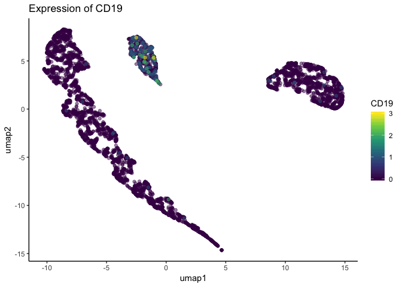

## Setup single cell data


```r
tenx_pbmc6k <- TENxPBMCData(dataset = "pbmc6k")
```

```
## snapshotDate(): 2019-04-29
```

```
## see ?TENxPBMCData and browseVignettes('TENxPBMCData') for documentation
```

```
## downloading 0 resources
```

```
## loading from cache 
##     'EH1610 : 1610'
```

### Filtering

I filter cells with high mitochondrial content as well as cells with low
library size or feature count.


```r
rowData(tenx_pbmc6k)$Mito <- grepl("^MT-", rowData(tenx_pbmc6k)$Symbol_TENx)
tenx_pbmc6k <- calculateQCMetrics(tenx_pbmc6k,
  feature_controls = list(Mt = rowData(tenx_pbmc6k)$Mito)
)
tenx_pbmc6k <- tenx_pbmc6k[, !colData(tenx_pbmc6k)$pct_counts_Mt > 50]

libsize_drop <- isOutlier(tenx_pbmc6k$total_counts,
  nmads = 3,type = "lower", log = TRUE
)
feature_drop <- isOutlier(tenx_pbmc6k$total_features_by_counts,
  nmads = 3, type = "lower", log = TRUE
)
tenx_pbmc6k <- tenx_pbmc6k[, !(libsize_drop | feature_drop)]
```

I filter any genes that have 0 count for all cells.


```r
rm_ind <- calcAverage(tenx_pbmc6k)<0
tenx_pbmc6k <- tenx_pbmc6k[!rm_ind,]
```

### Normalization

I normalize the data by using a simple library size normalization feature.


```r
tenx_pbmc6k <- normalize(tenx_pbmc6k)
```

### Dimension reduction

I use both Principal Components Analysis (PCA) and Uniform Manifold 
Approximation and Projection (UMAP) in order to obtain reduced dimension 
representations of the data.


```r
tenx_pbmc6k <- runPCA(tenx_pbmc6k)
tenx_pbmc6k <- runUMAP(tenx_pbmc6k, use_dimred = "PCA", n_neighbors = 50)
```

## Plotting


```r
gene <- "CD19"
gene_id <- match(gene, rowData(tenx_pbmc6k)$Symbol_TENx)
dat <- data.frame(umap1 = reducedDim(tenx_pbmc6k, "UMAP")[,1],
                  umap2 = reducedDim(tenx_pbmc6k, "UMAP")[,2],
                  gene = counts(tenx_pbmc6k[gene_id,]))

ggplot(dat, aes(x=umap1, y=umap2, colour=gene)) + geom_point(alpha=0.5) +
  theme_classic() + scale_color_viridis_c(name=gene)+ 
  ggtitle(paste0("Expression of ", gene))
```

<!-- -->


```r
dat <- dat[order(dat$gene, decreasing = FALSE),]

ggplot(dat, aes(x=umap1, y=umap2, colour=gene)) + geom_point(alpha=0.5) +
  theme_classic() + scale_color_viridis_c(name=gene) + 
  ggtitle(paste0("Expression of ", gene))
```

<!-- -->


```r
dat <- dat[order(dat$gene, decreasing = TRUE),]

ggplot(dat, aes(x=umap1, y=umap2, colour=gene)) + geom_point(alpha=0.5) +
  theme_classic() + scale_color_viridis_c(name=gene) + 
  ggtitle(paste0("Expression of ", gene))
```

<!-- -->


```r
tenx_pbmc6k <- make_hexbin(tenx_pbmc6k, nbins = 40, 
                           dimension_reduction = "UMAP")
gene_id_id <-rownames(tenx_pbmc6k)[gene_id]
plot_hexbin_gene(tenx_pbmc6k, type="logcounts", gene=gene_id_id, 
                 action="mean", xlab="UMAP1", ylab="UMAP2", 
                 title=paste0("Mean of ", gene))
```

<!-- -->
```

